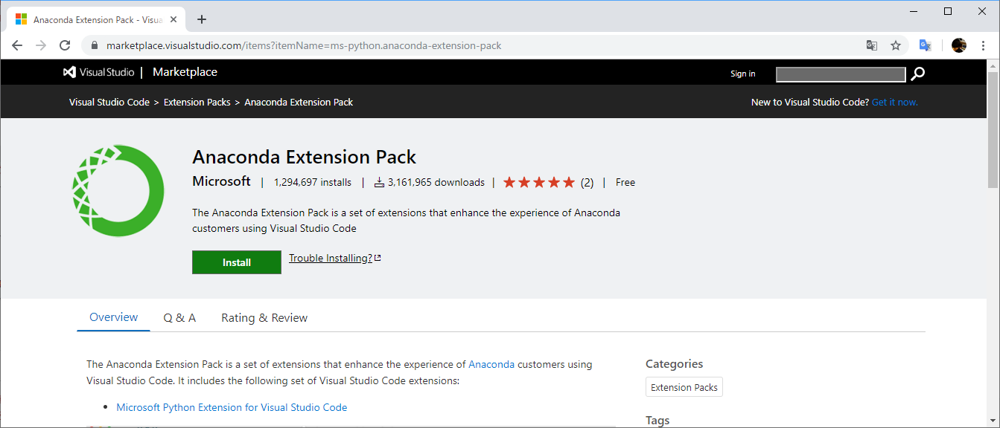

# Python向け拡張機能

Python開発に便利な拡張機能はマーケットプレイスの検索バーに「python」と入力して、マーケットプレイスで提供されている拡張機能を見つけることができます。検索でタグを利用するときは`tag：python`となります。

ここで便利な拡張機能をいくつかご紹介します。

---
## [Python Extension Pack(Microsoft)](https://marketplace.visualstudio.com/items?itemName=donjayamanne.python-extension-pack)

Pythonの開発に便利な機能を提供するエクステンションパックです。次の拡張機能が含まれます。

+ [Python拡張機能](https://marketplace.visualstudio.com/items?itemName=ms-python.python)
+ [MagicPython拡張機能](https://marketplace.visualstudio.com/items?itemName=magicstack.MagicPython)
+ [Jinja拡張機能](https://marketplace.visualstudio.com/items?itemName=magicstack.MagicPython)
+ [Django拡張機能](https://marketplace.visualstudio.com/items?itemName=batisteo.vscode-django)
+ [Visual Studio IntelliCode拡張機能](https://marketplace.visualstudio.com/items?itemName=VisualStudioExptTeam.vscodeintellicode)

---
## [Anaconda Extension Pack(Microsoft)](https://marketplace.visualstudio.com/items?itemName=ms-python.anaconda-extension-pack)

Anacondaユーザーに便利な機能を提供するエクステンションパックです。次の拡張機能が含まれます。

+ [Python拡張(Microsoft)](https://marketplace.visualstudio.com/items?itemName=ms-python.python)
+ [YAML拡張(Red Hat)](https://marketplace.visualstudio.com/items?itemName=redhat.vscode-yaml)

---
## [Python Docs拡張機能(Mukundan)](https://marketplace.visualstudio.com/items?itemName=Mukundan.python-docs)

VS CodeのエディターとしてPython公式サイトのドキュメントを開くことができます。

---
## [flask-snippets拡張機能(cstrap)](https://marketplace.visualstudio.com/items?itemName=cstrap.flask-snippets)

Pythonの軽量WebアプリケーションフレームワークであるFlaskのスニペットを提供します。

